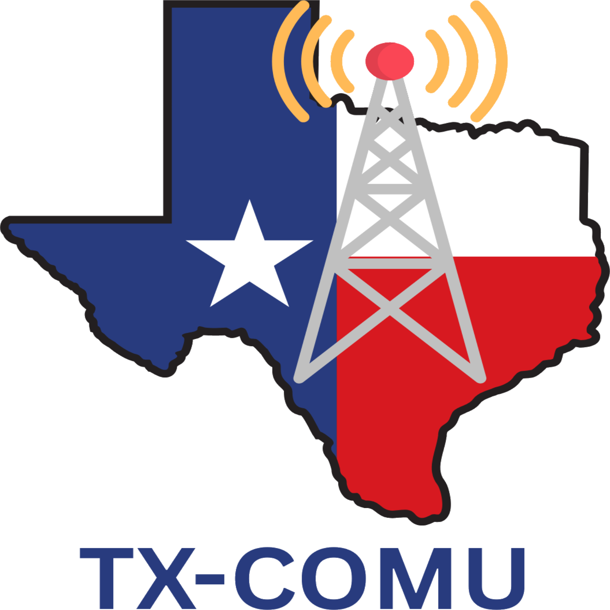
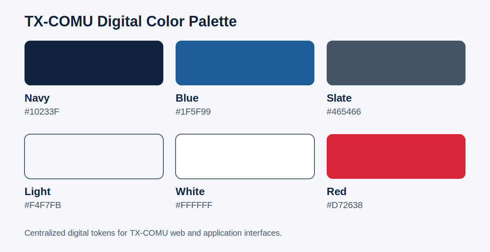

# TX-COMU Brand Guide

This directory is the central public source for the approved identity, messaging, and reusable brand assets of the **Texas Communications Unit (TX-COMU)**.

## Organization identity

| Use | Approved form |
| --- | --- |
| Official name | **Texas Communications Unit** |
| Abbreviation | **TX-COMU** |
| Website | [tx-comu.org](https://tx-comu.org) |
| Short description | Independent nonprofit supporting, connecting, and strengthening the Communications Unit community across Texas. |
| Status | Independent 501(c)(3) nonprofit organization |

On first reference in formal material, use **Texas Communications Unit (TX-COMU)**. The abbreviation **TX-COMU** may be used afterward.

## Mission statement

> TX-COMU strengthens Texas’ emergency communications capabilities by developing skilled communicators, advancing interoperable systems, and serving communities with integrity, readiness, and technical excellence.

The mission statement is controlled organizational language and should not be substantively rewritten without TX-COMU leadership approval.

## Brand character

TX-COMU communications should convey:

- Professionalism
- Credibility
- Readiness
- Stewardship
- Technical excellence
- Collaboration
- Service
- Resilience

The voice should be clear, professional, accurate, welcoming, and mission-focused. Use plain language when practical. Avoid exaggerated claims, unnecessary jargon, and wording that implies TX-COMU is the State of Texas credentialing authority.

## Logo

Approved logo files are available in [assets/logos](assets/logos/).

### Usage requirements

- Use the supplied artwork; do not redraw, trace, or rebuild the logo.
- Preserve the original proportions and transparent background.
- Do not stretch, rotate, crop, recolor, outline, or add effects.
- Maintain adequate clear space around the mark.
- Use the square organization-avatar version only where that composition fits the platform.
- Do not place the logo where contrast or surrounding artwork obscures it.
- Do not use the logo to imply endorsement, credentialing authority, or official State of Texas status.

## Digital color system

These values are the current centralized digital tokens used by the TX-COMU website.

| Token | HEX | RGB | Primary use |
| --- | --- | --- | --- |
| TX-COMU Navy | `#10233F` | 16, 35, 63 | Primary text, headers, dark surfaces |
| TX-COMU Blue | `#1F5F99` | 31, 95, 153 | Links, accents, interactive emphasis |
| TX-COMU Slate | `#465466` | 70, 84, 102 | Secondary text and metadata |
| TX-COMU Light | `#F4F7FB` | 244, 247, 251 | Light backgrounds and panels |
| White | `#FFFFFF` | 255, 255, 255 | Surfaces and reversed text |
| TX-COMU Red | `#D72638` | 215, 38, 56 | Limited emphasis and calls to attention |

Reusable tokens are provided in [CSS](assets/colors/tx-comu-colors.css) and [JSON](assets/colors/tx-comu-colors.json).

The logo contains additional colors that are part of the supplied artwork. Do not sample or substitute those colors as general-purpose brand tokens. Printed material should be proofed for its intended process and substrate before production.

## Typography

Use a clean, professional sans-serif typeface with strong readability on desktop and mobile. TX-COMU does not currently mandate a single organization-wide typeface. Digital projects should inherit the approved platform or theme font stack rather than introduce page-specific fonts.

Use a logical heading hierarchy, one H1 per page, and sufficient contrast consistent with WCAG 2.2 AA wherever practical.

## Photography and imagery

Prefer authentic TX-COMU photography showing real people, training, equipment, meetings, exercises, deployments, and partner activity. Avoid generic stock photography when authentic imagery is available.

Images must not disclose protected, private, or operationally sensitive information. AI-assisted editing may improve quality, lighting, cropping, or background consistency, but must not change identities, invent credentials, or create deceptive incident or deployment imagery.

## Brand asset rights

The TX-COMU name, abbreviation, logos, and other identifying marks are organizational brand assets. Their presence in this public repository does not place them under the license of another TX-COMU software project or grant permission to imply sponsorship, endorsement, affiliation, or credentialing authority.

For uses beyond accurate reference to TX-COMU, request permission through [tx-comu.org](https://tx-comu.org).

## Governance

This guide is the organization-wide public brand reference. Website-specific implementation standards remain in the private `TX-COMU-Website` repository. Changes to official identity, controlled messaging, or approved logo artwork require TX-COMU leadership approval.
