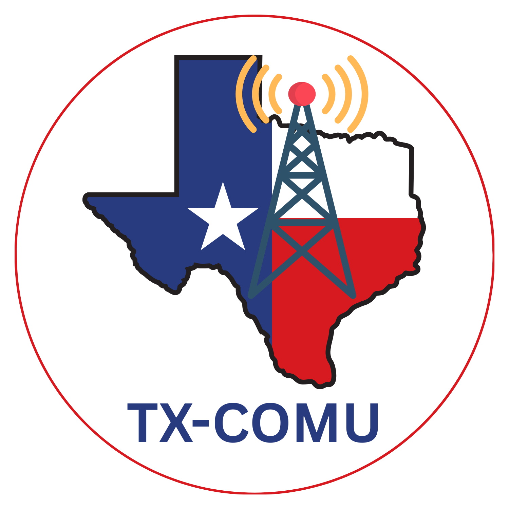
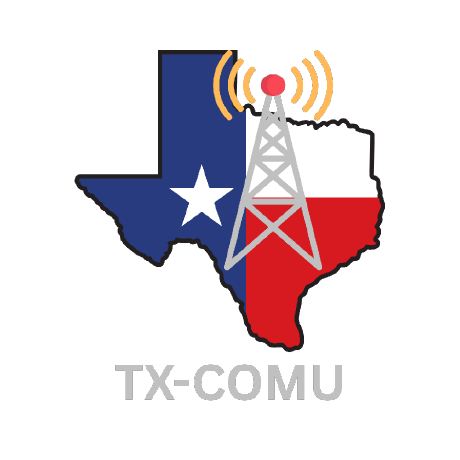

# Approved TX-COMU Logos

This directory contains the working web assets and the complete set of current source logos maintained in the Google Drive **Texas Communications Unit TX-COMU / Logo** folder.

The logos are arranged in preferred-use order. Use the standard TX-COMU identity without added symbols whenever possible. More complex specialty versions follow, and Tactical Chicken artwork is reserved for missions or events where the Tactical Chicken is making an appearance.

Click any preview or filename to open the full asset.

## 1. Preferred general-use logo — no additional symbols

This is the preferred TX-COMU logo for general web, document, presentation, and digital use.

<table>
  <tr>
    <th>Preview</th>
    <th>File and guidance</th>
  </tr>
  <tr>
    <td align="center"></td>
    <td><strong><a href="tx-comu-logo.png">tx-comu-logo.png</a></strong> PNG · 1563 × 1563 Transparent background <strong>Preferred general-use version</strong></td>
  </tr>
</table>

## 2. Core logo variations — no additional symbols

These files preserve the core TX-COMU identity while providing alternate text treatments, source formats, and a square-profile version. Choose the file that best fits the background and intended output.

<table>
  <tr>
    <th>Preview</th>
    <th>File and guidance</th>
  </tr>
  <tr>
    <td align="center"></td>
    <td><strong><a href="originals/TX-COMU%20BLUE%20Text.png">TX-COMU BLUE Text.png</a></strong> PNG · 1563 × 1563 Blue TX-COMU text on a transparent canvas</td>
  </tr>
  <tr>
    <td align="center"></td>
    <td><strong><a href="originals/TX-COMU%20%28transparent%29.png">TX-COMU (transparent).png</a></strong> PNG · 1563 × 1563 Light text on a transparent canvas; intended for dark backgrounds</td>
  </tr>
  <tr>
    <td align="center"></td>
    <td><strong><a href="originals/TX-COMU%20%28transparent%29.svg">TX-COMU (transparent).svg</a></strong> SVG · 500 × 500 Scalable vector source labeled transparent in the source folder</td>
  </tr>
  <tr>
    <td align="center"></td>
    <td><strong><a href="originals/TX-COMU.png">TX-COMU.png</a></strong> PNG · 1500 × 1500 Standard circular source logo</td>
  </tr>
  <tr>
    <td align="center"></td>
    <td><strong><a href="originals/TX-COMU.svg">TX-COMU.svg</a></strong> SVG · 500 × 500 Scalable standard vector source</td>
  </tr>
  <tr>
    <td align="center"></td>
    <td><strong><a href="tx-comu-github-avatar.png">tx-comu-github-avatar.png</a></strong> PNG · 460 × 460 Square-profile composition currently used for the TX-COMU GitHub organization avatar</td>
  </tr>
</table>

## 3. Expanded incident-symbol logo

Use this specialty version only when the added incident-communications imagery supports the purpose of the material.

<table>
  <tr>
    <th>Preview</th>
    <th>File and guidance</th>
  </tr>
  <tr>
    <td align="center"></td>
    <td><strong><a href="originals/TX-COMU%20with%20Symbols.PNG">TX-COMU with Symbols.PNG</a></strong> PNG · 1024 × 1024 Specialty logo with radio, fire, tornado, and hurricane symbols</td>
  </tr>
</table>

## 4. Tactical Chicken variants

Tactical Chicken logos are intentionally listed last. They are reserved for missions or events where the Tactical Chicken is making an appearance and should not replace the preferred TX-COMU identity in routine organizational use.

<table>
  <tr>
    <th>Preview</th>
    <th>File and guidance</th>
  </tr>
  <tr>
    <td align="center"></td>
    <td><strong><a href="originals/Tactical%20Chicken%20TX-COMU.png">Tactical Chicken TX-COMU.png</a></strong> PNG · 1563 × 1563 Mission- and event-specific Tactical Chicken variant</td>
  </tr>
</table>

## Source and maintenance notes

The files in [originals](originals/) are preserved with their Google Drive filenames unchanged.

The SVG files are authoritative Drive-sourced vector assets. They were uploaded without tracing, conversion, or other modification. Preserve the supplied artwork and do not represent raster artwork placed inside an SVG wrapper as a true vector logo.

When the source-of-truth Drive folder changes, update this directory, the preview order, and this inventory together.
